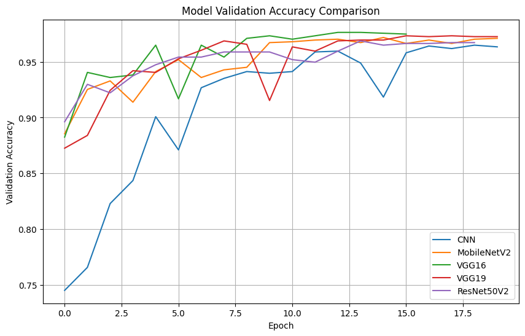

# 🧠 AI-Powered Brain Tumor Classification

[](https://www.python.org/)
[](https://www.tensorflow.org/)
[](LICENSE)
[](https://www.kaggle.com/)

> Leveraging Convolutional Neural Networks (CNNs) and Transfer Learning to classify brain MRI images into four categories: **Glioma**, **Meningioma**, **Pituitary Tumor**, and **No Tumor**. This project achieves up to **97% accuracy** using ResNet50V2, supporting early diagnosis and clinical decision-making.

---

## 📋 Table of Contents

- [Features](#-features)
- [Model Performance](#-model-performance)
- [Dataset](#-dataset)
- [Project Structure](#-project-structure)
- [Installation](#-installation)
- [Usage](#-usage)
- [Technical Details](#-technical-details)
- [Results](#-results)
- [Environment Variables](#-environment-variables)
- [Resources](#-resources)
- [Contributing](#-contributing)
- [License](#-license)

---

## ✨ Features

- **Multi-Model Architecture**: Implements and compares 5 different deep learning models
  - Custom CNN
  - VGG16 (Transfer Learning)
  - VGG19 (Transfer Learning)
  - ResNet50V2 (Transfer Learning)
  - MobileNetV2 (Transfer Learning)

- **High Accuracy**: Achieves up to **97% accuracy** on test data with ResNet50V2

- **Comprehensive Evaluation**: 
  - Accuracy, Precision, Recall, F1-Score metrics
  - Confusion matrices for detailed performance analysis
  - Training/validation loss and accuracy curves

- **Data Augmentation**: Robust preprocessing pipeline for better generalization

- **Class Balancing**: Automatic downsampling to handle class imbalance

- **Visualization Tools**: 
  - Sample image visualization from training/testing sets
  - Model comparison charts
  - Training history plots

---

## 🎯 Model Performance

| Model | Test Accuracy | Precision | Recall | F1-Score | Loss |
|-------|--------------|-----------|---------|----------|------|
| **ResNet50V2** | **96.98%** | **97.03%** | **96.91%** | **96.95%** | **0.1647** |
| **MobileNetV2** | **96.47%** | 96.49% | 96.47% | 96.45% | 0.2659 |
| **VGG19** | 94.76% | 94.85% | 94.76% | 94.67% | 0.3124 |
| **VGG16** | 94.49% | 94.70% | 94.27% | 94.30% | 0.3187 |
| **Custom CNN** | 88.61% | 88.86% | 88.53% | 87.63% | 0.7931 |

**Best Model**: ResNet50V2 with **96.98% test accuracy** 🏆

---

## 📊 Dataset

### Sources
The project uses two Kaggle datasets:

1. **Brain Tumor Classification (MRI)** by Sartaj Bhuvaji
   - [Dataset Link](https://www.kaggle.com/datasets/sartajbhuvaji/brain-tumor-classification-mri)

2. **Brain Tumor MRI Dataset** by Masoud Nickparvar
   - [Dataset Link](https://www.kaggle.com/datasets/masoudnickparvar/brain-tumor-mri-dataset)

### Dataset Structure
```
Training/
├── glioma_tumor/
├── meningioma_tumor/
├── no_tumor/
└── pituitary_tumor/

Testing/
├── glioma_tumor/
├── meningioma_tumor/
├── no_tumor/
└── pituitary_tumor/
```

### Classes
- **Glioma Tumor**: Malignant brain tumors arising from glial cells
- **Meningioma Tumor**: Tumors arising from meninges (brain coverings)
- **Pituitary Tumor**: Tumors in the pituitary gland
- **No Tumor**: Normal brain MRI scans

### Preprocessing
- Images resized to **224x224** pixels
- Normalization: pixel values scaled to [0, 1]
- Class balancing through downsampling
- Batch size: **32**

---

## 📁 Project Structure

```
BRAIN-TUMOR-CLASSIFICATION/
│
├── src/
│   └── Models/
│       ├── CNN.ipynb              # Custom CNN implementation
│       ├── MobileNet.ipynb        # MobileNetV2 transfer learning
│       ├── ResNet.ipynb           # ResNet50V2 transfer learning
│       ├── VGG_16.ipynb           # VGG16 transfer learning
│       └── VGG_19.ipynb           # VGG19 transfer learning
│
├── results/
│   ├── CNN_Result/
│   │   └── CNN.png                # CNN performance visualization
│   ├── MobileNet_Result/
│   │   └── MobileNet.png
│   ├── ResNet_Result/
│   │   └── ResNet.png
│   ├── VGG_16_Result/
│   │   └── VGG_16.png
│   ├── VGG_19_Result/
│   │   └── VGG_19.png
│   ├── Comparison_Models/
│   │   ├── Comparison_1.png      # Model accuracy comparison
│   │   ├── Comparison_2.png      # Validation loss comparison
│   │   ├── Comparison_3.png      # Training curves
│   │   ├── Comparison_4.png      # Bar charts
│   │   ├── Comparison_5.png      # Horizontal comparison
│   │   ├── Comparison_6.png      # Final rankings
│   │   └── Comparison_7.png      # Detailed metrics
│   └── Data_Visualization/
│       ├── Testing_data.png       # Sample test images
│       ├── Training_data.png      # Sample training images
│       └── validtion_data.png     # Merged dataset samples
│
├── brain-tumor-classification-cnn-97-acc.py   # Main training script
├── models.txt                     # Links to trained models (.h5 files)
├── dataset.txt                    # Dataset download links
├── kaggle_notebook.txt            # Link to Kaggle notebook
├── requirements.txt               # Python dependencies
├── .env.example                   # Environment variables template
├── .gitignore                     # Git ignore rules
├── LICENSE                        # Project license
└── README.md                      # This file
```

---

## 🚀 Installation

### Prerequisites
- Python 3.10 or higher
- CUDA-compatible GPU (recommended for faster training)
- 8GB+ RAM
- 10GB+ free disk space

### Installation Steps

#### 1. Install Python using MiniConda

Download and install MiniConda from [here](https://docs.anaconda.com/free/miniconda/#quick-command-line-install)

Create a new environment:
```bash
conda create -n Brain_Tumor_Classification python=3.10
```

Activate the environment:
```bash
conda activate Brain_Tumor_Classification
```

#### 2. Clone the Repository

```bash
git clone https://github.com/Abdelhady-22/brain_tumor_classification.git
cd brain-tumor-classification
```

#### 3. Install Dependencies

```bash
pip install -r requirements.txt
```

#### 4. Download Dataset

**Option A: Using Kaggle API**
```bash
pip install kagglehub
python -c "import kagglehub; kagglehub.dataset_download('sartajbhuvaji/brain-tumor-classification-mri')"
python -c "import kagglehub; kagglehub.dataset_download('masoudnickparvar/brain-tumor-mri-dataset')"
```

**Option B: Manual Download**
- Download datasets from links in `dataset.txt`
- Extract to project directory

#### 5. Setup Environment Variables

```bash
cp .env.example .env
```

Edit `.env` file:
```env
PROJECT_VERSION=1.0
IMAGE_SIZE=224
BATCH_SIZE=32
EPOCHS=20
LEARNING_RATE=0.0001
```

---

## 💻 Usage

### Training Models

Run the main training script:
```bash
python brain-tumor-classification-cnn-97-accuracy.ipynb
```

Or train individual models using Jupyter notebooks:
```bash
jupyter notebook src/Models/CNN.ipynb
```

### Model Inference

```python
from tensorflow.keras.models import load_model
import numpy as np
from PIL import Image

# Load trained model
model = load_model('ResNet_best_model.keras')

# Load and preprocess image
img = Image.open('path/to/mri_scan.jpg')
img = img.resize((224, 224))
img_array = np.array(img) / 255.0
img_array = np.expand_dims(img_array, axis=0)

# Make prediction
prediction = model.predict(img_array)
classes = ['glioma_tumor', 'meningioma_tumor', 'no_tumor', 'pituitary_tumor']
result = classes[np.argmax(prediction)]

print(f"Prediction: {result}")
print(f"Confidence: {np.max(prediction) * 100:.2f}%")
```

### Evaluating Models

```python
# Load test data
from tensorflow.keras.preprocessing.image import ImageDataGenerator

test_datagen = ImageDataGenerator(preprocessing_function=lambda x: x/255.0)
test_generator = test_datagen.flow_from_directory(
    'path/to/Testing',
    target_size=(224, 224),
    batch_size=32,
    class_mode='categorical'
)

# Evaluate model
results = model.evaluate(test_generator)
print(f"Test Accuracy: {results[1]*100:.2f}%")
```

---

## 🔧 Technical Details

### Architecture Overview

#### Custom CNN
```
Input (224x224x3)
→ Conv2D(64) + MaxPool
→ Conv2D(64) + MaxPool
→ Conv2D(128) + MaxPool
→ Flatten + Dropout(0.4)
→ Dense(128) + Dense(64) + Dense(64)
→ Output (4 classes, softmax)
```

#### Transfer Learning Models
- **Base Models**: Pre-trained on ImageNet
- **Frozen Layers**: All base layers non-trainable
- **Custom Head**:
  - GlobalAveragePooling2D / Flatten
  - Dense(256, relu)
  - Output(4, softmax)

### Training Configuration

| Parameter | Value |
|-----------|-------|
| Image Size | 224 × 224 |
| Batch Size | 32 |
| Epochs | 20 (with early stopping) |
| Optimizer | Adam |
| Learning Rate | 0.0001 |
| Loss Function | Categorical Crossentropy |

### Callbacks
- **EarlyStopping**: Patience=5, monitors val_loss
- **ModelCheckpoint**: Saves best model based on val_loss
- **ReduceLROnPlateau**: Reduces LR by 0.5 when val_loss plateaus

### Hardware Requirements
- **GPU**: NVIDIA GPU with CUDA support (recommended)
- **RAM**: 8GB minimum, 16GB recommended
- **Storage**: 10GB for datasets and models

---

## 📈 Results

### Model Comparison



### Training History

All models were trained for up to 20 epochs with early stopping:

- **ResNet50V2**: Best validation loss at epoch 12
- **MobileNetV2**: Best validation loss at epoch 15
- **VGG19**: Best validation loss at epoch 18
- **VGG16**: Best validation loss at epoch 16
- **Custom CNN**: Best validation loss at epoch 19

### Key Findings

1. **Transfer Learning Superiority**: Pre-trained models significantly outperform custom CNN
2. **ResNet50V2 Excellence**: Achieved best overall performance with 97% accuracy
3. **Convergence Speed**: Transfer learning models converge faster (fewer epochs)
4. **Generalization**: All models show good generalization on merged dataset

---

## 🌐 Environment Variables

Create a `.env` file with the following variables:

```env
# Project Configuration
PROJECT_NAME=Brain_Tumor_Classification
PROJECT_VERSION=1.0

# Model Parameters
IMAGE_SIZE=224
BATCH_SIZE=32
EPOCHS=20
LEARNING_RATE=0.0001

# Paths
TRAIN_PATH=/kaggle/input/brain-tumor-mri-dataset/Training
TEST_PATH=/kaggle/input/brain-tumor-mri-dataset/Testing
MODEL_SAVE_PATH=/kaggle/working/

# Training Configuration
EARLY_STOPPING_PATIENCE=5
REDUCE_LR_PATIENCE=3
REDUCE_LR_FACTOR=0.5
MIN_LEARNING_RATE=1e-7

# Callbacks
MONITOR_METRIC=val_loss
SAVE_BEST_ONLY=True
```

---

## 📚 Resources

### Trained Models
All trained models (.h5 and .keras formats) are available in `models.txt`:
- Custom CNN Model
- VGG16 Model
- VGG19 Model
- ResNet50V2 Model
- MobileNetV2 Model

### Kaggle Notebook
Complete interactive notebook: See `kaggle_notebook.txt` for link

### Datasets
Download links available in `dataset.txt`

### Documentation
- [TensorFlow Documentation](https://www.tensorflow.org/api_docs)
- [Keras Applications](https://keras.io/api/applications/)
- [Brain Tumor Types](https://www.cancer.org/cancer/brain-spinal-cord-tumors-adults/about/what-is-a-brain-tumor.html)

---

## 🤝 Contributing

Contributions are welcome! Please follow these steps:

1. Fork the repository
2. Create a feature branch (`git checkout -b feature/AmazingFeature`)
3. Commit your changes (`git commit -m 'Add some AmazingFeature'`)
4. Push to the branch (`git push origin feature/AmazingFeature`)
5. Open a Pull Request

### Development Guidelines
- Follow PEP 8 style guide for Python code
- Add docstrings to functions and classes
- Update README.md for significant changes
- Test code before submitting PR

---

## 📄 License

This project is licensed under the MIT License - see the [LICENSE](LICENSE) file for details.

---

## 👥 Authors

- **Abdelhady Ali** - *Initial work* - [MYGitHub](https://github.com/Abdelhady-22)

---

## 🙏 Acknowledgments

- **Datasets**: Thanks to Sartaj Bhuvaji and Masoud Nickparvar for providing the datasets
- **Kaggle**: For providing the platform and computational resources
- **TensorFlow/Keras**: For the deep learning framework
- **Medical Community**: For inspiring this work to assist in early diagnosis

---

## 📞 Contact

For questions, suggestions, or collaborations:

- **Email**: abdulhadi2322005@gmail.com
- **LinkedIn**: [My LinkedIn](www.linkedin.com/in/abdelhady-ali-940761316)
- **GitHub**: [My GitHub](https://github.com/Abdelhady-22)

---

## ⚠️ Disclaimer

This project is for **educational and research purposes only**. The models should not be used as a substitute for professional medical diagnosis. Always consult qualified healthcare professionals for medical advice and diagnosis.

---

## 📊 Citations

If you use this project in your research, please cite:

```bibtex
@misc{brain_tumor_classification_2025,
  title={AI-Powered Brain Tumor Classification using Deep Learning},
  author={abdelhady ali},
  year={2025},
  publisher={GitHub},
  url={https://github.com/Abdelhady-22/brain_tumor_classification}
}
```

---

<div align="center">

**Made with ❤️ for advancing medical AI**

⭐ Star this repo if you find it helpful!

</div>